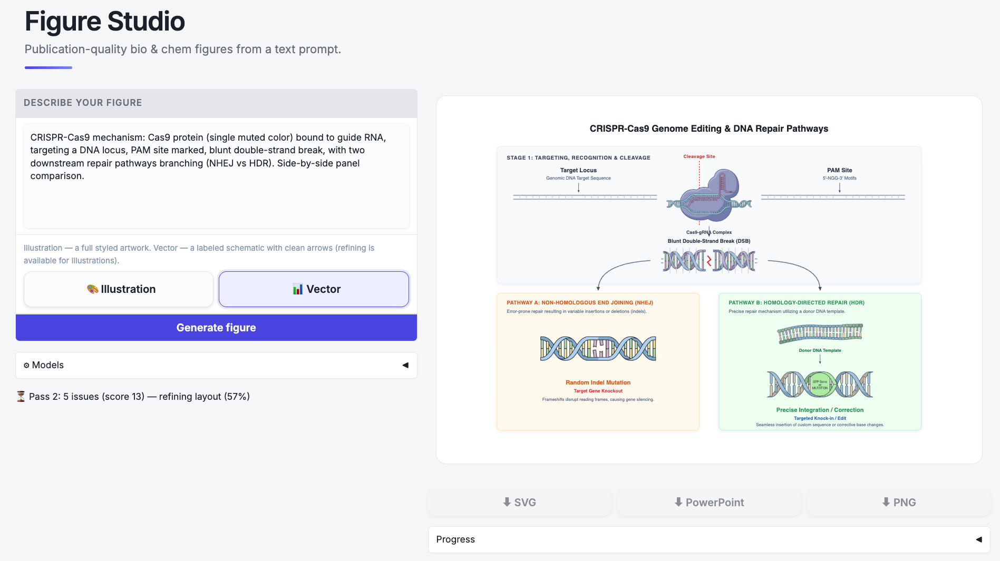

<div align="center">

# 🎨 Figure Studio

### 한 문장으로 만드는 논문급 생물·화학 figure.

pathway, mechanism, 세포 — 설명만 하면 논문이나 슬라이드에 바로 넣을 수 있는 깔끔하고 편집 가능한 figure가 나옵니다.

> [English README](README.md)



</div>

---

## 무엇을 하나

원하는 걸 입력하고, 스타일 고르고, 다운로드.

| | |
|---|---|
| 🎨 **Illustration** | 완성된 스타일 아트워크 — BioRender 풍 세포·해부도·장면. 바꾸고 싶은 걸 말로 설명하면 수정됩니다. |
| 📊 **Vector** | 깔끔한 라벨 도식 — pathway, cascade, mechanism. 선명한 화살표, 균형 잡힌 아이콘, PowerPoint에서 편집 가능. |

**SVG**, **PowerPoint**, **PNG** 한 번 클릭으로 export.

## 빠른 시작

**Python 3.12** 와 **Google AI Studio API 키** 가 필요합니다 ([무료 발급](https://aistudio.google.com/apikey)).

```bash
# 1. 설치 (uv 사용 — https://docs.astral.sh/uv)
uv sync

# 2. 키 입력
cp .env.example .env        # GOOGLE_API_KEY=... 붙여넣기

# 3. 실행
uv run uvicorn app.main:app --port 8000
```

**http://localhost:8000/ui** 열고 입력 시작하면 끝.

## 사용법

1. figure를 자연어로 **설명** — 구체적일수록 좋음.
2. Illustration / Vector **선택**.
3. **생성.** Vector는 다듬어지는 과정을 실시간으로 확인.
4. `◀ ▶` 로 버전들을 **넘겨보고** 마음에 드는 걸 선택.
5. SVG / PowerPoint / PNG로 **다운로드**.

> 💡 Vector SVG는 PowerPoint에서 **native 편집 도형**이 됩니다 (우클릭 → *Convert to Shape*).
> Illustration은 **대화로 수정** 가능 — "중복된 세포 제거", "핵 크게".

## 좋은 figure를 위한 팁

- 엔티티를 명시: *"EGF, EGFR, Ras, Raf, MEK, ERK"* 가 *"신호전달 경로"* 보다 훨씬 나음.
- 관계를 적기: *"X가 Y를 활성화"*, *"A가 B를 억제"*.
- 라벨을 다른 언어로? 프롬프트에 그 언어로 라벨을 적으면 됩니다.
- 다른 느낌이 필요하면 **⚙ Models** 에서 빠른/고품질 모델 전환.

## 작동 원리

Google **Gemini** (텍스트 + 이미지) 기반. Vector figure는 조립 후, 엄격한 시각 critic이 레이아웃을 여러 번 재검토합니다 — 화살표는 정확한 가장자리에 붙고, 라벨은 비켜나고, 아이콘 크기는 균형을 맞춰 — 각 요소가 개별적으로만 좋은 게 아니라 **합쳐졌을 때**도 맞아떨어지게.

## API

직접 호출하고 싶다면, 같은 서버에 작은 REST API가 있습니다:

```bash
curl -X POST localhost:8000/generate \
  -H 'content-type: application/json' \
  -d '{"prompt": "MAPK cascade: EGF → EGFR → Ras → Raf → MEK → ERK", "figure_kind": "mixed"}'
```

`figure_kind`: `mixed` (Vector) · `raster` (Illustration).
그 외: `POST /edit/{id}`, `GET /export/{id}/{svg|pptx|image}`, `GET /health`.

## 개발 & 테스트

```bash
uv run pytest                 # 전체 테스트
uv run pytest --run-live      # 실제 Gemini API 호출 (비용 발생)
```

## 라이선스

MIT — [LICENSE](LICENSE) 참조.
